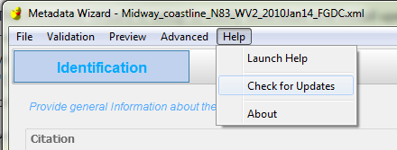

========================
Getting Software Updates
========================

The Metadata Wizard is set up to easily download and install updates directly from the GitHub repository. For this to work, the application must be installed in a location that the current user has write access to. If the application was installed with elevated or administrative privileges (in other words, the “C:\\Program Files” directory), this will not work unless the application is being run with elevated privileges when updating.

|
	
The application is configured to automatically look for updates whenever it is opened.  To manually update the application, click ‘Check for Updates’ in the ‘Help’ menu item at the top of the application. A message box will notify the user of the update status. If an update was made, the application will need to be restarted before the update is completed.

|

|  **Technical note:**

Updates are made using simple Git commands to **fetch** and **merge** the master branch from this GitHub repository. The commands to execute this operation are stored in a file called “update\_wizard.bat” in the application’s install folder. Other issues that might prevent this update from working include:

-  Edited or otherwise changed files in the local installation directory (merge conflict)
-  Internet connectivity issues
-  Firewalls or other security measures

Users with knowledge of Git can troubleshoot these problems directly in the project’s `GitHub <https://github.com/usgs/fort-pymdwizard>`_ repository.
