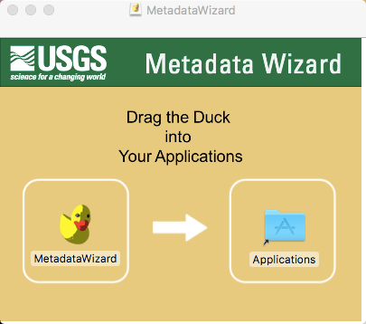

=================
Installing on Mac
=================

| Download a copy of the latest mac bundle (`MetadataWizard_osx_2.x.x.dmg) from
`the releases page
<https://github.com/usgs/fort-pymdwizard/releases>`_.

|
Once the download is complete, double click on the downloaded .dmg file to begin the installation.

|

   **Installation does require elevated (administrative) privileges.** After installation the MetadataWizard can be launched from the duck icon (|duck|) in the user’s applications.

.. |duck| image:: img/duck.png
   :width: 18pt
