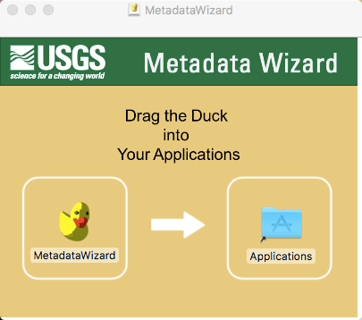

=================
Installing on Mac
=================

#. Download the Mac installer (**MetadataWizard_2.0.7.dmg**) from the `v2.0.7 release page <https://github.com/DOI-USGS/fort-pymdwizard/releases/tag/v2.0.7>`_.

   Note: there isn’t a Mac installer for the most recent release, **v2.1.0**.
   Download the **v2.0.7** installer above, then pull updates from within the application to upgrade to v2.1.0.

   |

#. Double click on the downloaded .dmg file to begin the installation.

|

    If you get an error relating to unidentified developer software, run the following commands in the Terminal (may require elevated permissions). You may also need to check System Preferences, Security and Privacy as shown `here <https://support.apple.com/en-us/HT202491>`_.

    **Open terminal and run:**

    - sudo spctl --master-disable
    - sudo xattr -d com.apple.quarantine /Applications/MetadataWizard.app
    - Open finder and navigate to /Applications and double click MetadataWizard icon. This should open the app (may take a moment).
    - After opening the app successfully, switch settings back to normal by running this code in the terminal: sudo spctl --master-enable

    **Installation may require elevated (administrative) privileges.** After installation the MetadataWizard can be launched from the duck icon (|duck|) in the user’s applications.

