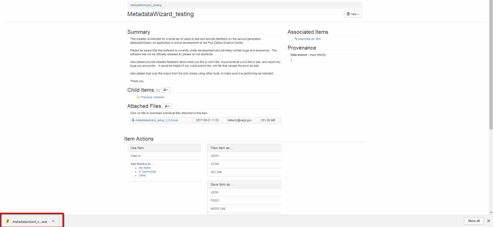

====================
Installing on Windows
====================

| Download a copy of the latest Windows installer (`metadatawizard_setup_2.x.x.exe) from
`the releases page
<https://github.com/usgs/fort-pymdwizard/releases>`_.

|
Once the download is complete, double click on the .exe file in the web browser to begin the installation.

Installation **does not** require elevated (administrative) privileges. Most users will want to select the defaults as they step through the installation process. When the installation finishes, the application can be launched from the duck icon (|duck|) on the user’s desktop or start menu.

.. |duck| image:: img/duck.png
   :width: 18pt
