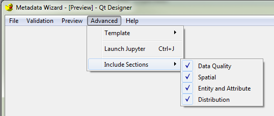

==========================================
Include/Exclude Optional Metadata Sections
==========================================

Some scenarios when creating metadata do not require the use of all available FGDC
metadata sections, such as when creating a project-level metadata record, which can 
be used to summarize a collection of metadata records relating to a project.

Creating such a metadata record can be accomplished in Metadata Wizard by using the 
**Include Sections** feature.  This feature is located on the Advanced menu.

|image0|

The default is for all sections to be active, designated by a checkmark to the left of
each section.  To deactivate a section, click that section.  The section's checkmark 
will be removed, and the section's tab in the main window of the tool will be blank.

**Users should be advised that generally, all sections are required when creating metadata
at the dataset level.**  

