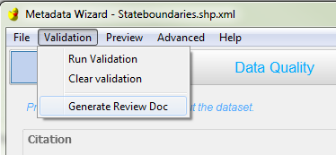
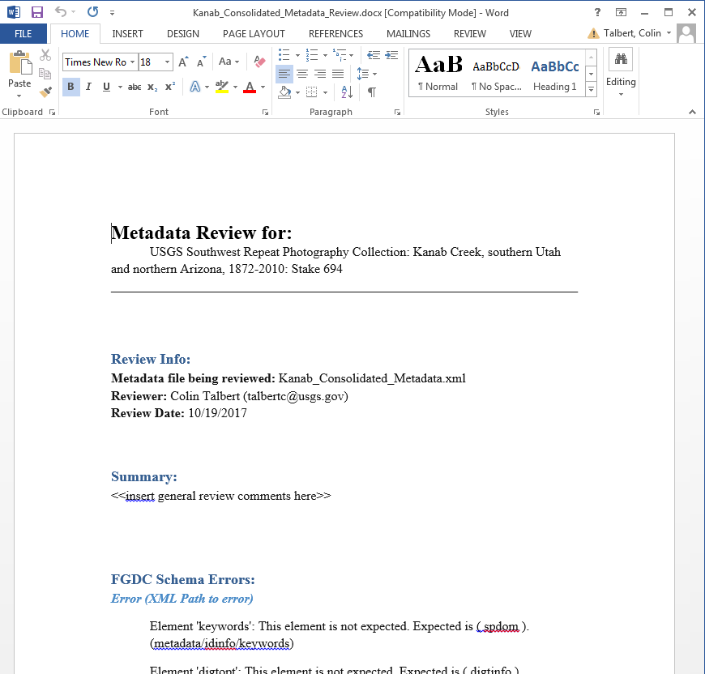

Making a Metadata Review Report
*******************************

Many metadata vetting workflows require the creation of a review report 
that documents issues identified in the record.  The MetadataWizard includes
a metadata report builder that creates a review report in Microsoft Word (.docx) format. 
This report will be saved into the same directory that contains the metadata file (.xml) current open.
The output will be named identically as the .xml file, but with '.xml' replaced with '_Review.docx'

Included in the report are:

- What file (xml) is being reviewed.
- The date the report was created.
- The person conducting the review.
- A section for general or summary comments.
- A list of FGDC errors encountered.
- The html version of the complete record.

This report is generated by clicking the Generate Review Doc
option in the Validation menu.

|image0|

|

Once generated the report opens in the default application for .docx files, typically Microsoft Word.
The document can now be checked over for spelling errors and other issues and comments, clarifications, and suggestions can be added.

|image1|

It is beyond the scope of this document to provide detailed instructions on how to perform a comprehensive metadata review.
See https://www2.usgs.gov/datamanagement/describe/metadata.php. for more details on the process. 

