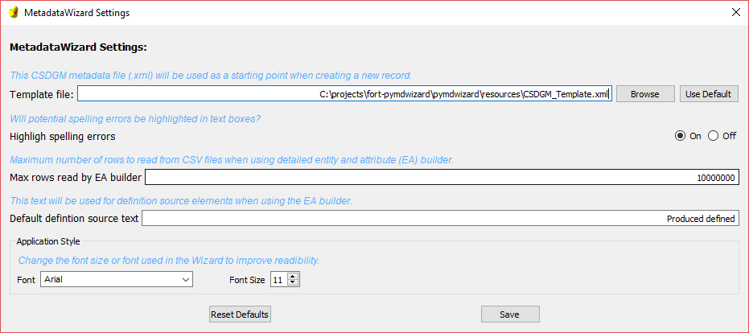

=============================
Changing Application Settings
=============================

Certain application settings can be easily set by the user by using the MetadataWizard settings form.
This form can be found under the Advanced menu item.  Changes to settings will be remembered between usages of
the MetadataWizard.

The settings available include:

  -  Template file:  Specify a template file to use when creating a new record.  See: `Changing Your Template <Changing%20Your%20Template.html>`_
  -  Turn on or off highlighting spelling errors.
  -  The maximum number of rows to read from a dataset when building an entity and attribute builder.
  -  The default text to use for "Definition source" when building an entity and attribute section.
  -  The font style and size to use in the application.

