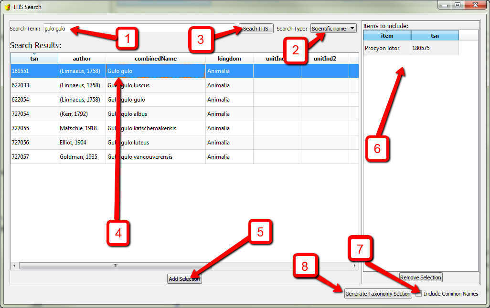

Generating a Taxonomic Information Section
********

In an FGDC record the Taxonomy section is used to record information
about the species (or other level) being studied.

Finding the taxonomy section
----------------------------

Because it part of the Biological Data Profile, the taxonomy section will not be available
within the Metadata Wizard unless ‘FGDC Biological Data Profile of the
CDGSM’ is selected in the Metadata Standard Name on the Metadata
Reference Tab.

| To add a Taxonomy section to a record select ‘Yes’ to expand the
  Taxonomy box on the Identification Tab (halfway down on the left).
| |image0|

|
|

Using the taxonomy section builder
----------------------------------

It is suggested that users auto-generate Taxonomy Sections using the built in tool which pulls
data from web services hosted by the `Integrated Taxonomic Information
System (ITIS)`_

To launch the Taxonomy builder click the button ‘Add Items from ITIS’

| A form for searching and selecting taxonomic items to include in the
  record will pop up:
| |image1|

#. Start by entering a scientific or common name into the ‘Search Term’
   box. The term used can be from any level of the scientific heirarchy
   (order, family, species, sub-species, etc.).
#. Make sure that ‘Search Type’ either ‘Scientific Name’ or ‘Common
   Name’ matches the search term used.
#. Click ‘Search ITIS’ to get a list of search results which will be
   displayed below.
#. Select one or more items from this list.
#. Click ‘Add Selection’ to add the selected item to the list of
   taxonomic items that will be included.
#. Steps 1-5 can be run as many times as needed to complete the list of
   items to include. If any item needs to be removed from this list,
   select the item and click the ‘Remove Selection’ button below.
#. If you would like to include the common names in your taxonomy
   section check this box.
#. Click the ‘Generate Taxonomy Section’ button to create a taxonomy
   section based on the the list in the ‘Items to include:’ box above.

Limitations
-----------

**Be aware that currently the Taxonomy section in the Metadata Wizard
does not contain the ‘Taxonomic System’ section of the standard, nor is
it intended to allow for creating a record manually from scratch.**

.. _Integrated Taxonomic Information System (ITIS): https://www.itis.gov/

.. |image0| image:: ../img/taxonomy_no.png
