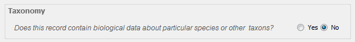

==========================================
Generating a Taxonomic Information Section
==========================================

In an FGDC record, the Taxonomy section is used to record information
about the species (or other nomenclatural level) represented in the data.

Enabling the Taxonomy Section
-----------------------------

The taxonomy section is not available within the Metadata Wizard unless 
‘FGDC Biological Data Profile of the CDGSM’ is selected in the Metadata 
Standard Name, located on the Metadata Reference tab.

| In order to add a Taxonomy section to a record, navigate to the Identification tab
 (halfway down on the left), select the **Yes** button to expand the Taxonomy box, and then
 use the builder described below (the information cannot be added without using the builder).
| |image0|

|
|

Using the Taxonomy Section Builder
----------------------------------

It is suggested that users auto-generate Taxonomy Sections using the built in tool which pulls
data from web services hosted by the `Integrated Taxonomic Information
System (ITIS)`_ (note that this tool requires internet access). 

To launch the Taxonomy builder, click the button **Add Items from ITIS**

A form for searching and selecting taxonomic items to include in the record will open:
| |image1|

#. Start by entering a scientific or common name into the Search Term
   box. The term used can be from any level of the scientific hierarchy
   (order, family, species, sub-species, etc.).
#. Make sure that for Search Type either Scientific Name or Common
   Name matches the search term used.
#. Click **Search ITIS** to get a list of search results which will be
   displayed in the Search Results section.
#. Select one or more items from the Search Results list.
#. Click **Add Selection** to add the selected item to the list of
   taxonomic items that will be included (displayed on the right panel of the window).
#. Steps 1-5 can be run as many times as needed to complete the list of
   items to include. If any item needs to be removed from this list,
   select the item and click the **Remove Selection** button below.
#. If common names should be included in the taxonomy section, check this box.
#. Click the **Generate Taxonomy Section** button to create a taxonomy
   section based on the list in the **Items to include:** box above.

Limitations
-----------

**Be aware that currently the Taxonomy section in the Metadata Wizard
does not contain the Taxonomic System section of the standard, nor is
the tool intended for creating a Taxonomy section manually, without using the Taxonomy Builder tool.**

.. _Integrated Taxonomic Information System (ITIS): https://www.itis.gov/

.. |image1| image:: ../img/taxonomy_builder.png
