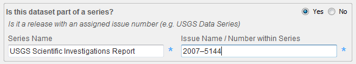
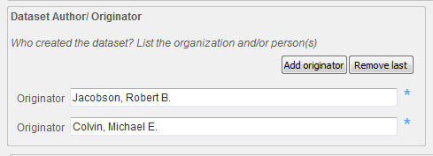
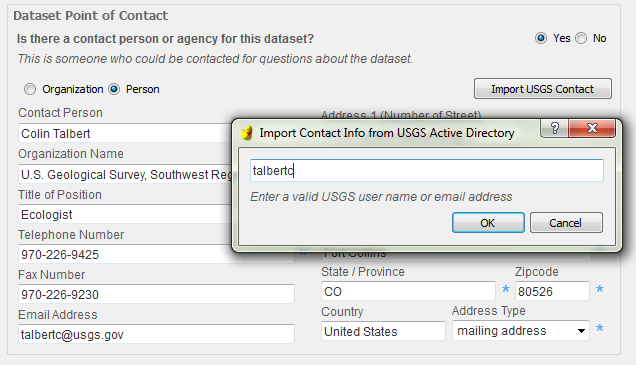

Using the Metadata Wizard
********

|

Sections
--------

The Metadata Wizard 2.0 is set up as a series of forms/tabs where you will enter information about your data set. These tabs are broken down categorically into sections that roughly correspond to the sections in an FGDC metadata record.

-  **Identification** : *What the data is, who created it, associated publications, when it was created, etc.*
-  **Data Quality** : *How was the data created (methodology), what sources were used, what quality control was used.*
-  **Spatial** : *Where is the data geographically, what spatial projection or reference is it in, how is it organized spatially.*
-  **Entity and Attribute** : *How is the data organized tabularly, what is in each of the columns, what units are they in, etc.*
-  **Distribution** : *How would someone obtain the data.*
-  **Metadata Reference** : *Who made the metadata record, when, what standard was used.*

|

Filling out a record
--------------------

Cycle through each of the sections above by clicking on the blue labels across the top of the application. On each one, enter appropriate content into the text boxes. These text boxes correspond to FGDC CSDGM elements and often have hints below the element titles that help to identify the appropriate content. Items marked with a blue \* are required to be filled out.

|

Expanding a collapsed element
-----------------------------

	
	Some compound items are hidden until you check the ‘Yes’ radio button next to the question asking if they are needed for that record. For example, if your data is part of a series you will want to record the series name and number in the Citation on the Identification tab. These will not be visible until you check Yes to the question ‘Is this dataset part of a series?’.
	
|

Adding or removing items in a list (repeating elements)
--------------------

	
	Items that can be repeated multiple times such as authors, keywords,
	online linkages, etc., have buttons for adding additional sections or
	removing the last one.
	
|

Using tools to auto-populate compound element
--------------------	

	
	Some elements contain convenience tools for populating their content
	which are launched by clicking the button in that section. For example,
	contact information for USGS users can be populated by clicking the
	‘Import USGS Contact’ button in a contact section, and entering their
	Active Directory username.
	
Other tools include adding keywords from controlled vocabularies, populating a citation section from an active Digital Object Identifier (DOI), or generating a taxonomy section from the Integrated Taxonomy Information Service (ITIS).
