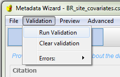
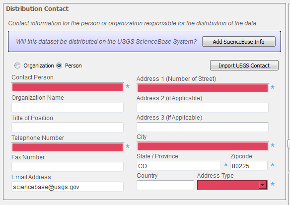
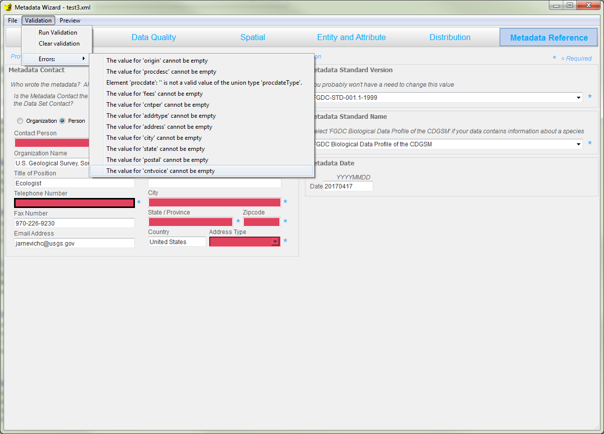

Validating a Record
********

A first quality check of a metadata record is to make sure it adheres to
to the FGDC standard. Examples of items that can be flagged include:

- missing content in required fields 
- incorrectly formatted items 
- values outside an acceptable range
- other violations

These errors can be identified directly in the tool by clicking ‘Run
Validation’ in the Validation item on the menu bar. The record will be
validated and a message box will pop up alerting you to the number of
errors found.

|image0|

The items that are causing validation errors will be highlighted in red on the
Metadata Wizard.

|image1|

There is also a window that will pop up, showing a list of all the errors
found.  Clicking on one of these will take you to the tab/section that contains
the error and outline it in black.  But keep in mind that some errors might be
hidden until you scroll up or down in the application or select the appropriate tab.

|image2|

